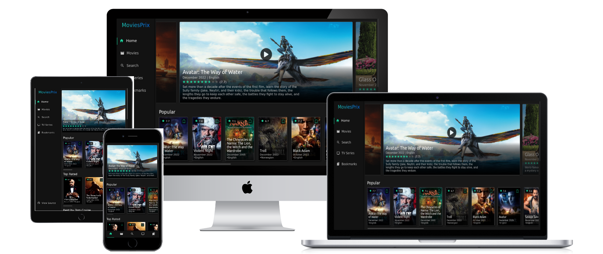

<div align="center">
    
  <h2>MoviesPrix - Movies Website</h2>
  <p>MoviesPrix is fully responsive website built using Next.js's appDir feature </p>
    <a href="https://moviesprix.netlify.app/" target="_blank">➥ Live Demo</a>
</div>

## About
This website is built using Next.js 13 and use TMDB API to fetch movie and TV serial data.

On this website, users can search for and explore movies and TV serials, as well as bookmark their favorites for easy access later. This website is also fully responsive, so it can be easily accessed and used on any device, including desktop computers, laptops, tablets, and smartphones.

To get started, you will need to obtain an API key from TMDB by creating an account on their website (https://www.themoviedb.org/). Once you have your API key, you can set it as an environment variable.

To run the website locally, clone the repository and run the following commands:

1. Clone repository using git clone
   ```bash
    git clone https://github.com/devXprite/MoviesPrix
    ```
2. Navigate to the project directory
   ```bash
    cd MoviesPrix
    ```
3. Install dependencies
   ```bash
    npm install
    ```
4. Get your TMDB API key from [here](https://www.themoviedb.org/) and set it as an environment variable in `.env` file
   ```bash
    TMDB_API_KEY=<your_api_key_here>
    ```
5. Run the development server
   ```bash
    npm run dev
    ```

This will start the development server and the website will be available at http://localhost:3000.

## Features
- Fully responsive design
- Search for movies and TV serials
- Explore movies and TV serials by popular, top rated, and upcoming releases
- Bookmark movies and TV serials for easy access later

## Technologies Used
- Next.js 13
- React
- Node.js
- SCSS

<h2>ScreenShot</h2>
<div align="center">
    
</div>

## Contributions
If you would like to contribute to this project, please fork the repository and submit a pull request with your changes. All contributions are welcome and appreciated! 


